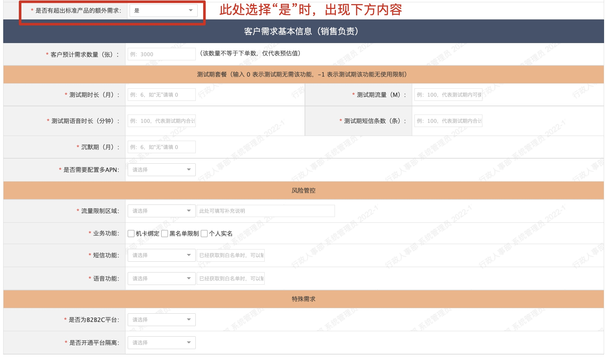
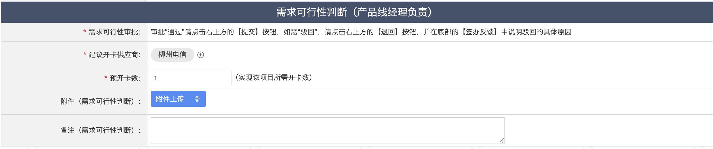
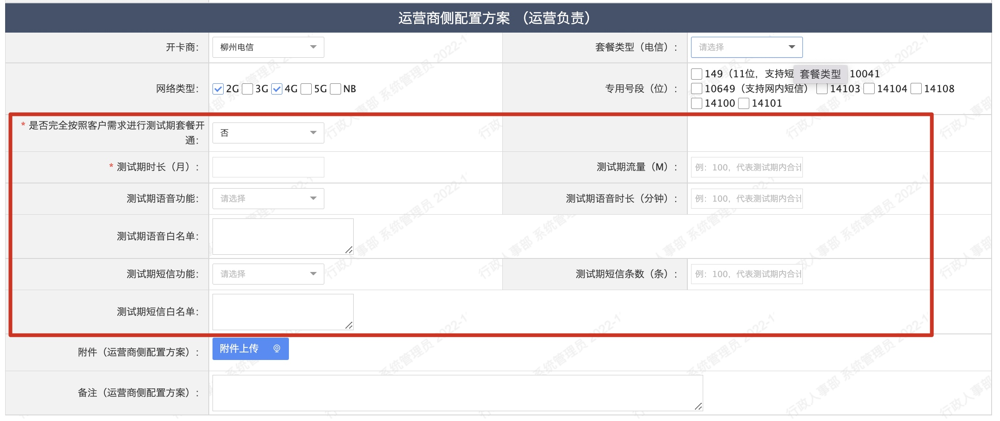
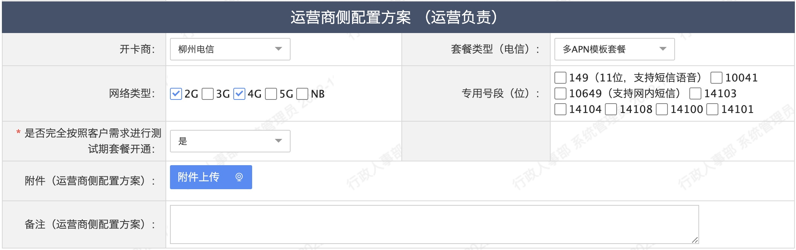
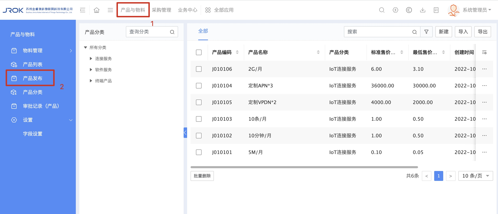

# 2.2 产品与物料

## 概述

【产品与物料】中的物料可以理解为商品，里面涵盖的任何一个物料（商品），除了用于销售同事进行日常对外销售使用外，还可以给到内部的运营、采购、售后、技术同事们用于数据查询。而物料是由产品组成
> 公司来了一个新销售张三，他想知道公司哪些产品可以对外销售，此时就可以打开我们OA中的【物料列表】中进行查看，如果感觉【物料列表】中的物料不能满足他的要求，那么张三可以到【物料申请】中申请一个新的物料

## 物料申请

* 使用物料申请的两个场景：
  * 【物料列表】中缺少销售需要的物料（商品），此时可以发起【物料申请】。
  * 当销售发现了某个商机，虽然这个商机还没有具体针对的客户，但您认为公司应该提前准备相关物料（商品）。
* 发起步骤：
  * 入口：“产品与物料-物料管理-物料申请”
    
  * 部分字段说明：
    
  * 客户：如果该需求并非针对某个客户，可省略此项。支持选择或文字输入系统中已录入的客户
  * 客户物料编码：如果客户尚未提供物料编码，此项可省略；
  * 物料描述：简要说明一下需求大致情况，如果觉得填写完成详细信息中的字段后可以将需求完整说明，此项可省略；
  * JROK产品：选择【产品列表】中的各项产品

    > 在创建“物料”时，为了减少创建人填写过多的重复项，特地把“物料”中的一些与价格有关的信息提取出来组成“产品”（Tips：每个产品编码对应一个唯一的“产品”。系统不支持直接使用“产品”下单，即使某“物料”和“产品”完全相同，也需要先基于“产品”创建“物料”，然后使用“物料”下单）

  * 物料分类：目前仅设计套餐相关的物料申请，此处直接输入“IoT连接服务”即可（支持选择或手动输入）；
    1. “IoT连接服务”字段说明
    
      * 客户预计需求数量（张）：说明客户大致需要多少 张/套；
      * 是否需要配置多APN：需要车联网套餐或其它多apn套餐时，此处选择“是”，下方将会弹出相关的配置项：
    
      * APN/DNN 别名：输入大家日常沟通时使用的APN简称即可（例：APN1、APN2 等）；
      * 流量大小：因流量的单位会根据不同的情况进行变化，所以此处建议输入完整的流量名称（例：2G/月/用户）；
      * 使用说明：填写该APN的具体用途

## 物料审批
  * 需求可行性判断（产品线经理负责）
    
  * 参数配置收集（项目经理负责）
    
    * 物料为“多APN模板套餐”时，请在附件中提交相关文件，以便后续的运营和采购同事使用
  * 运营商侧配置方案 （运营负责）：
    
    * 是否完全按照客户需求进行测试期套餐开通：当选择“是”时，红框内的测试期套餐无需输入（采购直接按照销售和项目经理收集 的信息进行测试期套餐配置）
    * 审批“单卡阶梯套餐时”：
      * 流量阈值提醒方式：单选项，可选“无”、“数值提醒”和“比例提醒”；
      * 提醒阈值（M或比例系数）：与“流量阈值提醒方式”配合使用，
        * （例①：选择了“数值提醒”后，输入300，则表示该APN使用300M流量后，需提醒客户）
        * （例②：选择了“比例提醒”后，输入40,80,100，则表示当用量到达40%或80%或100%时，都需要提醒客户）
    * 审批“多APN模板套餐”时：
    
     * 流量阈值提醒方式：单选项，可选“无”、“数值提醒”和“比例提醒”；
     * 提醒阈值（M或比例系数）：与“流量阈值提醒方式”配合使用，
       * （例①：选择了“数值提醒”后，输入300，则表示该APN使用300M流量后，需提醒客户）
       * （例②：选择了“比例提醒”后，输入40,80,100，则表示当用量到达40%或80%或100%时，都需要提醒客户）
  * 运营商侧配置结果 （采购负责）：
    

## 产品申请

* 在创建“物料”时，为了减少创建人填写过多的重复项，特地把“物料”中的一些与价格有关的信息提取出来组成“产品”（Tips：每个产品编码对应一个唯一的“产品”。系统不支持直接使用“产品”下单，即使某“物料”和“产品”完全相同，也需要先基于“产品”创建“物料”，然后使用“物料”下单）。

* 发起步骤
  * 入口：“产品与物料-产品发布”
    
  * 部分字段说明：
    
  * 产品名称：新输入的“产品名称”不能与现有产品的“产品名称”重复；
  * 产品编码：短期内需根据物料编码规则手动输入，系统自动生成产品编码的功能将于近期上线；
  * 产品分类：手动输入（支持模糊查询）或者点击“+”进行手动选择；
    > 申请套餐时，请选择“IoT连接服务”
    1. “IoT连接服务”字段说明（部分字段已记录在上方的【物料申请】中）
       
       * 连接服务子类：下拉单选，包含“流量”、“语音”、“短信”、“定制APN”和“定制VPDN”等，选择某一项后，即可输入该项对应的值及价格。选择不同
        * 标准售价（元）：公司内部约定的标准售价，不等同于最后销售给客户的实际价，实际价格可在“物料申请”时根据所填写的“折扣系数”来决定该产品在不同套餐中的实际价格
