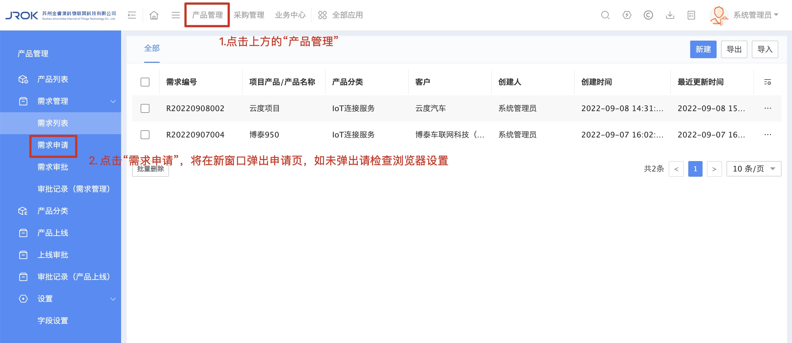
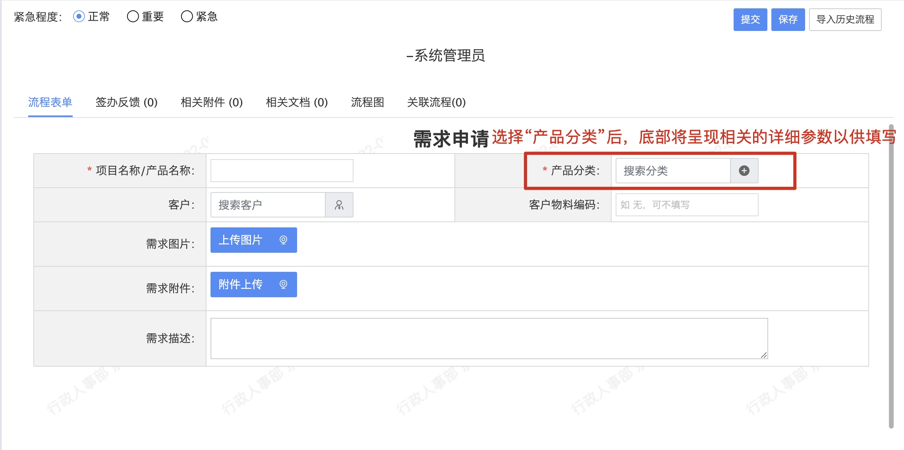
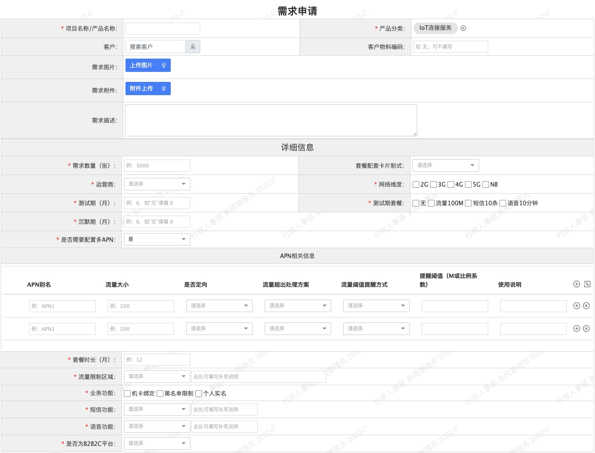
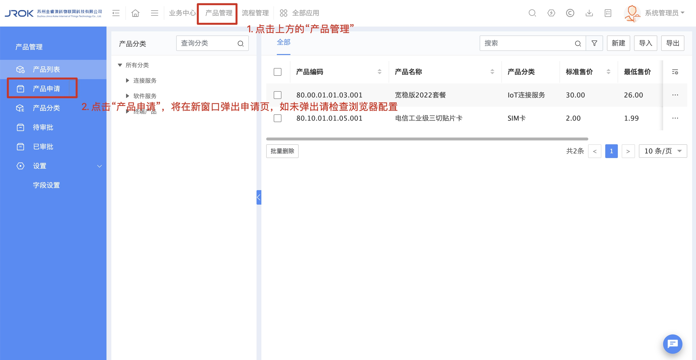

# 2.2 产品管理
## 概述
本系统中的【产品管理】中的产品也可以理解为商品，里面涵盖的任何一个产品（商品），除了用于sales进行销售外，还可以给到内部的运营、采购、售后、技术同事们用于数据查询。
> 公司来了一个新销售张三，他想知道公司哪些产品可以对外销售，此时就可以打开我们OA中的产品管理进行查询
## 需求申请
* 使用需求申请的两个场景：
    * 【产品列表】中缺少客户需要的产品，此时可以发起【需求申请】，会有相关产品线的同事对此需求进行审核，以确认公司是否可以实现该需求；
    * 当您发现了某个商机，虽然这个商机还没有具体针对的客户，但您认为公司产品库中应该具备该产品以应对未来的销售。
* 发起步骤：
    * 入口：“产品管理-需求管理-需求申请”
    
    * 部分字段说明：
        * 产品分类：目前仅设计套餐相关的需求申请，此处直接输入“IoT连接服务”即可（支持选择或手动输入）；
        * 客户：如果该需求并非针对某个客户，可省略此项。支持选择或输入系统中已录入的客户，如没有找到合适的客户，可联系 @陈昊天；
        * 客户物料编码：如果客户尚未提供物料编码，此项可省略；
        * 需求描述：简要说明一下需求大致情况，如果觉得填写完成详细信息中的字段后可以将需求完整说明，此项可省略；
            1. “IoT连接服务”字段说明
                * 需求数量（张）：说明该需求转换成产品后大致会出售多少张/套；
                * 是否需要配置多APN：需要车联网套餐或其它多apn套餐时，此处选择“是”，下发将会弹出相关的配置项；
                
                * APN别名：输入大家日常沟通时使用的APN简称即可（例：APN1、APN2 等）；
                * 流量大小：因流量的单位会根据不同的情况进行变化，所以此处建议输入完整的流量名称（例：2G/月/用户）；
                * 流量阈值提醒方式：单选项，可选“无”、“数值提醒”和“比例提醒”；
                * 提醒阈值（M或比例系数）：与“流量阈值提醒方式”配合使用，
                    * （例①：选择了“数值提醒”后，输入300，则表示该APN使用300M流量后，需提醒客户）
                    * （例②：选择了“比例提醒”后，输入40,80,100，则表示当用量到达40%或80%或100%时，都需要提醒客户）
                * 使用说明：填写该APN的具体用途
## 产品申请
* 对于公司而言，每个产品的申请上线都需要一个相应的流程，OA系统的作用之一就是承载相关流程。
> 当前流程：
> 1. 产品线经理（发起）：负责将产品的各个参数都填入系统中，在该流程中，产品经理是最懂产品的那个人；
> 2. 技术部负责人（审批）：负责查看产品中涉及技术或者配置参数的部分是否具备操作可行性；
> 3. 采购部负责人（审批）：负责确认市面上是否能够采购到符合相关参数的产品；
> 4. 运营部负责人（审批）：负责确认产品中的各项参数是否符合公司运营要求；
> 5. 财务部负责人（审批）：负责确认产品中的标准售价（含税价）和最低售价（含税价）是否合理；
> 6. 分管副总经理（终审）：综合以上的各个环节结果，判断该产品是否具备推出价值。
* 发起步骤
    * 入口：“产品管理-产品上线”
    
    * 部分字段说明：
        * 产品名称：新输入的“产品名称”不能与现有产品的“产品名称”重复；
        * 产品编码：短期内需根据物料编码规则手动输入，系统自动生成产品编码的功能将于近期上线；
        * 产品分类：手动输入（支持模糊查询）或者点击“+”进行手动选择；
            > 申请套餐时，请选择“IoT连接服务”
            1. “IoT连接服务”字段说明（部分字段已记录在上方的【需求申请】中）
                * 套餐类型：需先选择“运营商”字段后，套餐类型字段才会显示具体选项
                * APN套餐信息-标准价（元）：根据公司内部确认的标准售价，不等同于最后销售给客户的实际价，实际价根据不同的订单来确定
                * 模板号：该产品对应运营商侧配置套餐
    * 审批说明：后续每个环节审批时
